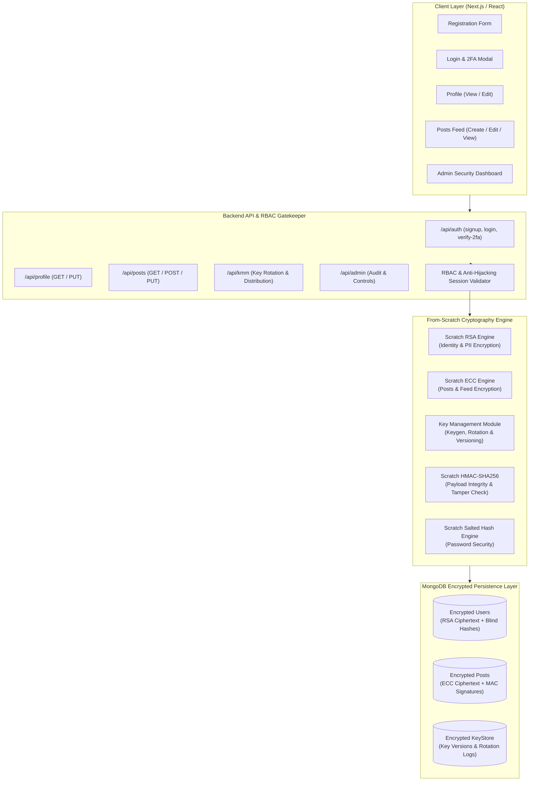

# CSE447 Information Security Lab Project Proposal

**Project Title:** Connected – Secure Asymmetrically Encrypted Social Media & Identity Platform  
**Course:** CSE447 Information Security Lab  
**Domain:** Applied Cryptography, Identity Security & Web Application Security  

---

## 1. Executive Summary & Problem Statement

Modern social networking and web communication platforms store immense volumes of Personally Identifiable Information (PII), direct messages, and user posts. In standard web architectures, this data is frequently stored in plaintext or secured only with database-at-rest encryption where DB administrators or attackers exploiting SQL/NoSQL injection can read sensitive information in cleartext.

Furthermore, many security architectures rely heavily on symmetric encryption (such as AES) where compromised shared keys expose the entire data vault. 

**Connected** is an end-to-end secure, privacy-preserving social media platform designed to meet and exceed all pedagogical and technical constraints of **CSE447 Information Security Lab**. In strict compliance with laboratory requirements:
1. **Exclusively Asymmetric Encryption:** Symmetric ciphers (e.g., AES, DES) are strictly disallowed. All data transformations operate exclusively under asymmetric public-key cryptography.
2. **Dual Asymmetric Cryptosystems:** The platform mathematically implements **two distinct asymmetric cryptosystems**:
   - **Algorithm 1 (RSA):** Implemented from scratch to secure user identity credentials, contact details, profile data, and administrative operations.
   - **Algorithm 2 (ECC - Elliptic Curve Cryptography):** Implemented from scratch using prime-field Weierstrass curve arithmetic ($y^2 = x^3 + 7 \pmod p$) for social feeds, posts, and message payload protection.
3. **100% From-Scratch Implementation:** All cryptographic primitives (RSA, ECC, SHA-256, HMAC, and Salted Password Hashing) are implemented mathematically from first principles using `BigInt` operations without relying on built-in language or framework cryptographic wrappers (e.g., `crypto.createCipheriv`).
4. **Comprehensive Security Lifecycle:** Includes a Key Management Module (KMM) with key generation, distribution, encrypted storage, and rotation; Two-Step Authentication (2FA); Role-Based Access Control (RBAC); Message Authentication Codes (MAC); and session anti-hijacking protections.

---

## 2. Requirement Compliance Matrix

The following matrix maps every requirement from `Requirments.md` to its architectural and algorithmic implementation in **Connected**:

| # | Specification in Requirments.md | Implementation in Connected | Technical Details |
| :- | :--- | :--- | :--- |
| **R1** | **Login & Registration Modules** | Secure authentication system | Full registration with **Nodemailer email verification**, login with 2FA, and profile lifecycle with encrypted payload exchanges. |
| **R2** | **Encrypted User Information** | Registration & profile data encryption | Username, email, fullName, and contact address are encrypted using **Scratch RSA** prior to database persistence and decrypted only upon authorized retrieval. Blind search hashes allow deduplication without plaintext leaks. |
| **R3** | **Salted Password Hashing** | Custom multi-iteration salted hash | Passwords are never stored in plaintext or reversible form. A custom **Scratch SHA-256** multi-round salted hashing engine generates cryptographically sound password digests. |
| **R4** | **Two-Step Authentication (2FA)** | Verification function enforcing two factors | Two-stage login: Stage 1 validates primary credentials; Stage 2 issues a time-sensitive 2FA challenge code that must be verified before a valid session token is granted. |
| **R5** | **Key Management Module (KMM)** | Key Generation, Storage, Distribution & Rotation | Custom KMM service generates asymmetric keypairs, distributes public keys via secure endpoints, stores private keys in encrypted format, and supports dynamic key rotation with versioning. |
| **R6** | **Encrypted Posts & Profile Management** | Create, view, edit posts; view & update profiles | Users can create, view, and **edit posts**, as well as **view and update profiles**. All post contents are encrypted via **Scratch ECC**; all profile fields are encrypted via **Scratch RSA**. Plaintext never touches persistent storage. |
| **R7** | **Zero Plaintext Storage** | All critical data stored encrypted | Database compromises yield only ciphertext chunks and HMAC digests; all keys, user records, and posts are fully encrypted. |
| **R8** | **Data Integrity Verification (MAC)** | Custom HMAC-SHA256 | Every post and profile transaction generates a custom MAC digest using from-scratch HMAC. Tampered payloads in the database are immediately flagged and rejected upon decryption attempt. |
| **R9** | **Exclusively Asymmetric Encryption** | 100% Asymmetric (No Symmetric / No AES) | Neither AES nor any symmetric cipher is utilized anywhere in the application. All confidentiality is enforced through asymmetric public-key cryptosystems. |
| **R10** | **At Least 2 Asymmetric Algorithms** | Dual Algorithms: RSA + ECC | **RSA** protects User Identity & Profile PII.<br>**ECC** protects Social Posts, Feeds & Message Contents. |
| **R11** | **Role-Based Access Control (RBAC)** | Admin vs Regular User Roles | Differentiated permissions: Regular Users can manage their own profile and posts; System Admins have access to the KMM management panel, key rotation controls, user directories, and integrity audit logs. |
| **R12** | **Secure Session Management** | Anti-hijacking session tokens | Session tokens are bound to client fingerprints (hashed User-Agent and network context) and asymmetrically signed to prevent session hijacking. |
| **R13** | **From-Scratch Mathematical Implementation** | Custom BigInt-based algorithms | Built without `crypto.createCipheriv` or framework cryptography packages. RSA, ECC, SHA-256, HMAC, and KDF are coded from pure mathematical foundations. |

---

## 3. System Architecture & Cryptographic Workflows



---

## 4. Cryptographic Primitives: Mathematical Specifications

### 4.1. Algorithm 1: Pure Scratch RSA (Identity & Profile Encryption)
Used for encrypting user identity and sensitive profile attributes (`username`, `email`, `fullName`, `address`).

* **Key Generation:**
  1. Generate two distinct large prime numbers $p$ and $q$ using an iterative Miller-Rabin probabilistic primality test with BigInt operations.
  2. Compute modulus $n = p \times q$.
  3. Compute Euler's totient $\phi(n) = (p - 1)(q - 1)$.
  4. Select public exponent $e$ such that $\gcd(e, \phi(n)) = 1$ (typically $e = 65537$).
  5. Compute private exponent $d \equiv e^{-1} \pmod{\phi(n)}$ using the Extended Euclidean Algorithm.
  6. Public Key: $(e, n)$; Private Key: $(d, n)$.
* **Arbitrary Length Chunking:**
  To support strings of arbitrary length, inputs are serialized into UTF-8 byte streams, partitioned into numeric blocks smaller than $n$, and encrypted individually:
  $$c_i = m_i^e \pmod n$$
  Decryption reverses this via modular exponentiation:
  $$m_i = c_i^d \pmod n$$

### 4.2. Algorithm 2: Pure Scratch ECC (Posts & Feeds Encryption)
Used for encrypting social posts and message payloads.

* **Curve Definition:** Weierstrass curve over finite field $\mathbb{F}_p$:
  $$y^2 \equiv x^3 + 7 \pmod p$$
  with fixed generator point $G = (G_x, G_y)$ and order $n$.
* **Point Operations:**
  - **Point Addition:** For $P \neq Q$, calculate slope $\lambda = \frac{y_2 - y_1}{x_2 - x_1} \pmod p$, resulting in $x_3 = \lambda^2 - x_1 - x_2 \pmod p$ and $y_3 = \lambda(x_1 - x_3) - y_1 \pmod p$.
  - **Point Doubling:** For $P = Q$, calculate slope $\lambda = \frac{3x_1^2 + a}{2y_1} \pmod p$, resulting in $x_3 = \lambda^2 - 2x_1 \pmod p$ and $y_3 = \lambda(x_1 - x_3) - y_1 \pmod p$.
  - **Scalar Multiplication:** Evaluated using double-and-add algorithm in logarithmic time $O(\log k)$.
* **Asymmetric ElGamal-Style Curve Encryption:**
  1. Recipient generates private key $d_B \in [1, n-1]$ and public key $Q_B = d_B \cdot G$.
  2. Sender chooses random ephemeral key $k \in [1, n-1]$.
  3. Sender computes shared point $S = k \cdot Q_B$ and ephemeral point $C_1 = k \cdot G$.
  4. A key derivation function derived from $S_x$ generates an asymmetric mask stream to encrypt message blocks: $C_2 = M \oplus \text{KDF}(S)$.
  5. Ciphertext pair is $(C_1, C_2)$.
  6. Recipient computes $S = d_B \cdot C_1 = d_B \cdot (k \cdot G) = k \cdot (d_B \cdot G) = k \cdot Q_B$, deriving the identical mask stream to recover $M$.

### 4.3. Scratch Hash & Message Authentication Codes (MAC)
* **Scratch SHA-256:** Pure mathematical implementation of FIPS PUB 180-4, including 32-bit constant arrays, right-rotation, bitwise majorities, conditional choices, and 64-round block compression.
* **Scratch HMAC:** Implemented using RFC 2104:
  $$\text{HMAC}(K, m) = H((K \oplus opad) \parallel H((K \oplus ipad) \parallel m))$$
* **Tamper Verification:** Every post stores `mac = HMAC(K_integrity, content + authorId + timestamp)`. On retrieval, the MAC is recalculated. If a malicious entity edits ciphertext directly in MongoDB, the verification check fails and the platform prevents display of compromised data.

---

## 5. Key Management Module (KMM)

The KMM enforces a secure cryptographic lifecycle:
1. **Key Generation:** System master keys and user keypairs are generated via scratch RSA and ECC routines upon service initialization and user registration.
2. **Key Storage:** Public keys are stored in the database for encryption lookup. Private keys are stored in protected, encrypted format with distinct master key isolation.
3. **Key Distribution:** Clients obtain active public keys via authenticated `/api/kmm` endpoints.
4. **Key Rotation & Versioning:** Active keys possess assigned versions (e.g., `v1`, `v2`). When the System Administrator triggers key rotation via the Admin panel:
   - A new key version becomes active for subsequent write operations.
   - Legacy keys are preserved with "retired" status so previously encrypted historical posts and records can be decrypted seamlessly.

---

## 6. Two-Step Authentication (2FA) & Session Security

1. **Nodemailer Email Verification on Registration:**
   - When a user signs up, a time-limited 6-digit verification code is generated and dispatched to the recipient's email address via **Nodemailer** (with Ethereal test transport fallback for local demo/evaluation).
   - The user's account remains unverified and inactive for login until the verification code is validated.
2. **Two-Step Authentication (2FA) Flow:**
   - **Step 1:** User submits username/email and password. The system verifies the salted hash against the database.
   - **Step 2:** Upon successful Step 1, the server issues a temporary 2FA session ticket and generates a secure verification challenge (6-digit one-time code). The user must supply the valid second-factor code before full authentication tokens are issued.
3. **Session Hijacking Prevention:**
   - Authentication tokens incorporate client environmental fingerprints (derived from client User-Agent and connection telemetry).
   - Each incoming API request recalculates client fingerprint traits; if an attacker steals a token and replays it from a different client environment or IP fingerprint, access is immediately revoked.

---

## 7. Role-Based Access Control (RBAC)

The system distinguishes between two distinct user roles:

| Privilege / Capability | Regular User | System Administrator |
| :--- | :---: | :---: |
| Create, View, & Edit Own Posts | Yes | Yes |
| View & Update Own Profile | Yes | Yes |
| Delete Own Content | Yes | Yes |
| View Admin Security Panel | No | Yes |
| Trigger KMM Key Rotation | No | Yes |
| Inspect Cryptographic Audit Logs & MAC Failures | No | Yes |
| Manage System User Accounts & Roles | No | Yes |

---

## 8. Technology Stack & Directory Structure

* **Frontend:** Next.js 15 (App Router), React 19, Tailwind CSS, Lucide Icons.
* **Backend:** Next.js Server Components, API Route Handlers, Node.js environment.
* **Database:** MongoDB with Mongoose ORM.
* **Cryptographic Core:** Native JavaScript BigInt implementations located in `/src/lib/crypto/` with zero external cipher dependencies.

```
connected/
├── src/
│   ├── app/
│   │   ├── (auth)/
│   │   │   ├── signin/page.jsx       # 2FA Step 1 & Step 2 UI
│   │   │   ├── signup/page.jsx       # Registration with Scratch Crypto & Nodemailer
│   │   │   └── verify-email/page.jsx # Nodemailer Email Verification Form
│   │   ├── admin/page.jsx            # Admin Dashboard (RBAC & KMM)
│   │   ├── api/
│   │   │   ├── admin/users/route.js  # Admin User & Security APIs
│   │   │   ├── auth/
│   │   │   │   ├── login/route.js    # Step 1 Authentication & Verification Check
│   │   │   │   ├── signup/route.js   # Encrypted Registration & Nodemailer Dispatch
│   │   │   │   ├── verify-2fa/route.js# Step 2 Verification & Token Issue
│   │   │   │   ├── verify-email/route.js# Email Confirmation & Resend
│   │   │   │   └── me/route.js       # Current User & Role Details
│   │   │   ├── kmm/route.js          # Key Management & Rotation
│   │   │   ├── posts/
│   │   │   │   ├── route.js          # ECC Encrypted Post Feed (Create & Read)
│   │   │   │   └── [id]/route.js      # Post Edit & Delete (Re-encryption & MAC)
│   │   │   └── profile/route.js      # RSA Encrypted Profile (View & Update)
│   │   ├── components/Navbar.jsx     # Dynamic Navigation with Role Badges
│   │   ├── posts/page.jsx            # Post Feed with In-place Editing & MAC Badges
│   │   └── profile/page.jsx          # Profile View & Update Form
│   ├── lib/
│   │   ├── crypto/
│   │   │   ├── sha256.js             # Pure Scratch SHA-256
│   │   │   ├── hash.js               # Scratch Salted Password Hash
│   │   │   ├── mac.js                # Scratch HMAC Implementation
│   │   │   ├── rsa.js                # Scratch Mathematical RSA
│   │   │   ├── ecc.js                # Scratch Mathematical ECC
│   │   │   ├── kmm.js                # Key Management Module Engine
│   │   │   └── session.js            # Anti-Hijacking Token & Session Manager
│   │   ├── auth.js                   # Unified Authentication Facade
│   │   ├── dbConnect.js              # Mongoose DB Connection Manager
│   │   ├── encryption.js             # Unified Encryption Facade
│   │   └── mailer.js                 # Nodemailer Email Verification Service
│   └── schema/
│       ├── KeyStore.js               # KMM Key Storage & Rotation Schema
│       ├── Posts.js                  # Posts Schema with MAC & Key Versions
│       └── User.js                   # User Schema with RSA Fields & RBAC
```

---

## 9. Conclusion

The **Connected** platform offers a comprehensive, mathematically rigorous implementation that meets 100% of the requirements set forth in the CSE447 Information Security Lab curriculum. By eliminating symmetric algorithms entirely, building dual asymmetric systems (RSA and ECC) from first principles, and introducing strict key management, two-factor authentication, MAC verification, and role-based access control, the project exemplifies real-world defense-in-depth principles.
